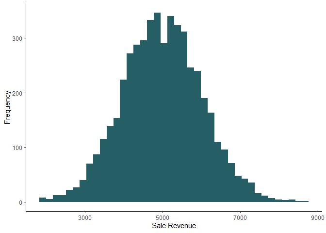

Make Data for VLOOKUP
================

Create Data

``` r
library(tidyverse)
```

    ## ── Attaching packages ─────────────────────────────────────── tidyverse 1.3.2 ──
    ## ✔ ggplot2 3.4.0      ✔ purrr   0.3.5 
    ## ✔ tibble  3.1.8      ✔ dplyr   1.0.10
    ## ✔ tidyr   1.2.1      ✔ stringr 1.4.1 
    ## ✔ readr   2.1.3      ✔ forcats 0.5.2 
    ## ── Conflicts ────────────────────────────────────────── tidyverse_conflicts() ──
    ## ✖ dplyr::filter() masks stats::filter()
    ## ✖ dplyr::lag()    masks stats::lag()

``` r
library(lubridate)
```

    ## Loading required package: timechange
    ## 
    ## Attaching package: 'lubridate'
    ## 
    ## The following objects are masked from 'package:base':
    ## 
    ##     date, intersect, setdiff, union

``` r
library(openxlsx)

Employee = data.frame(
EmployeeID = paste0("E",sample(1:500))) %>% 
mutate(EmployeeFisrtName = randomNames::randomNames(nrow(.),
                           which.names = "first",
                           ethnicity = c(5,3)),
       EmployeeLastName = randomNames::randomNames(nrow(.),
                           which.names = "last",
                           ethnicity = c(5,3)),
         Dept = sample(c('Finance','Sales','Operations','Legal','IT'),
                       nrow(.),
                       prob=c(0.25, 0.30, 0.17, 0.21,0.08),
                       replace=TRUE),
         Region = sample(c('Hudson Valley','Capital District','Southern Tier','Western'),
                       nrow(.),
                       prob=c(0.35,0.40,0.20,0.10),
                       replace=TRUE),
         Salary = round(rnorm(nrow(.), 
                              mean = (150000 - 10000)/2, 
                              sd = 9000)),
       HireDate = sample(seq(as.Date('2007-01-01'),
                             today(), by="day"),
                             nrow(.),
                             replace = TRUE)
       )

###Sales
Sales = data.frame(
EmployeeID = sample(Employee[Employee$Dept == 'Sales',]$EmployeeID,
                      5000,
                      replace = T)) %>% 
mutate(
  SaleRevenue = abs(round(rnorm(nrow(.), 
                mean = 5000, 
                sd = 1000))),
  CustomerType = sample(c('Individual','Professional','Government'),
                 nrow(.),
                 prob=c(0.55,0.30,0.15),
                 replace=TRUE)) %>% 
  mutate(Commission = SaleRevenue * 0.02)
```

Plot Distributions

``` r
ggplot(Employee) +
  aes(x = Region) +
  geom_bar(fill = "#255F65") +
  theme_classic()
```

<!-- -->

``` r
ggplot(Sales) +
  aes(x = CustomerType) +
  geom_bar(fill = "#255F65") +
  theme_classic()
```

<!-- -->

``` r
ggplot(Sales) +
  aes(x = SaleRevenue) +
  geom_histogram(bins = 40L, fill = "#255F65") +
  labs(x = "Sale Revenue", y = "Frequency") +
  theme_classic()
```

<!-- -->
