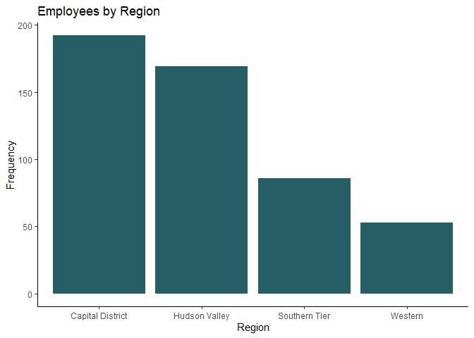
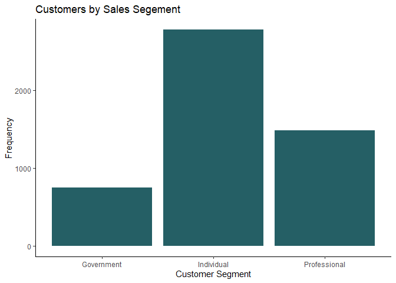
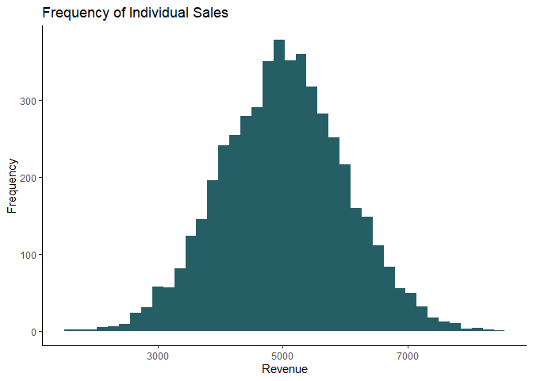
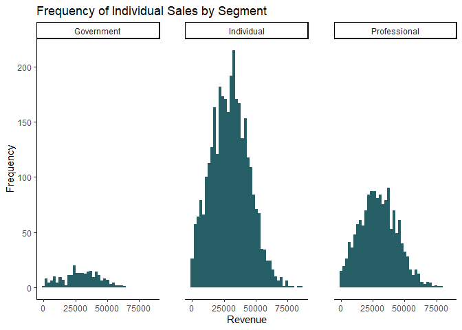
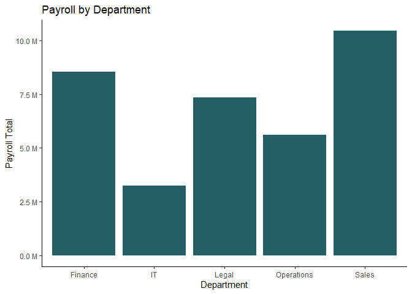
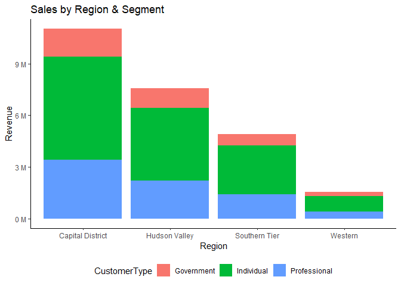
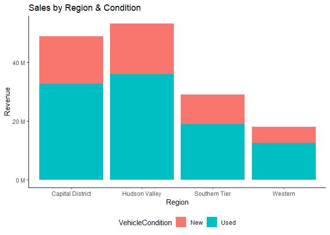

Creating (Meaningful) Random Data
================

This notebook is used to create data for a fictional regional car
dealership \## Make dataset

Create random employees…

``` r
options(warn=-1)
suppressMessages(library(tidyverse))
suppressMessages(library(lubridate))
library(openxlsx)

Employee = data.frame(
EmployeeID = paste0("E",sample(1:500))) %>% 
mutate(EmployeeFisrtName = randomNames::randomNames(nrow(.),
                           which.names = "first",
                           ethnicity = c(5,3)),
       EmployeeLastName = randomNames::randomNames(nrow(.),
                           which.names = "last",
                           ethnicity = c(5,3)),
         Dept = sample(c('Finance','Sales','Operations','Legal','IT'),
                       nrow(.),
                       prob=c(0.25, 0.30, 0.17, 0.21,0.08),
                       replace=TRUE),
         Region = sample(c('Hudson Valley','Capital District','Southern Tier','Western'),
                       nrow(.),
                       prob=c(0.35,0.40,0.20,0.10),
                       replace=TRUE),
         Salary = round(rnorm(nrow(.), 
                              mean = (150000 - 10000)/2, 
                              sd = 9000)),
       HireDate = sample(seq(as.Date('2007-01-01'),
                             today(), by="day"),
                             nrow(.),
                             replace = TRUE)
       )
```

- **EmployeeID** = Sequential number 1 - 500 prefixed with “E”

- **EmployeeFirstName** = Names created from the `randomNames` package

- **EmployeeLastName** = Names created from the `randomNames` package

- **Dept** = Department; 5 departments with the corresponding
  distribution (%) in the `prob` argument

- **Region** = 4 regions with the corresponding distribution (%) in the
  `prob` argument

- **Salary** = Normal distribution across employees with a mean of
  \$70,000 and a standard deviation of \$9,000

- **HireDate** = Random date between January 1st, 2007 and today

Now create sales data for only employees in the Sales department…

``` r
###Sales
Sales = data.frame(
EmployeeID = sample(Employee[Employee$Dept == 'Sales',]$EmployeeID,
                      5000,
                      replace = T)) %>% 
mutate(
  SaleRevenue = abs(round(rnorm(nrow(.), 
                mean = 30000, 
                sd = 15000))),
  VehicleCondition = sample(c('New','Used'),
                 nrow(.),
                 prob=c(.33,.67),
                 replace=TRUE),
  CustomerType = sample(c('Individual','Professional','Government'),
                 nrow(.),
                 prob=c(0.65,0.30,0.05),
                 replace=TRUE)) %>% 
  mutate(Commission = SaleRevenue * 0.02)
```

## Plot Distributions

Employee and sales data…

``` r
ggplot(Employee) +
  aes(x = Region) +
  geom_bar(fill = "#255F65") +
    labs(
    x = "Region",
    y = "Frequency",
    title = "Employees by Region"
  ) +
  theme_classic()
```

<!-- -->

``` r
ggplot(Sales) +
  aes(x = CustomerType) +
  geom_bar(fill = "#255F65") +
    labs(
    x = "Customer Segment",
    y = "Frequency",
    title = "Customers by Sales Segement"
  ) +
  theme_classic()
```

<!-- -->

``` r
ggplot(Sales) +
  aes(x = SaleRevenue) +
  geom_histogram(bins = 40L, fill = "#255F65") +
  labs(x = "Sale Revenue", y = "Frequency") +
    labs(
    x = "Revenue",
    y = "Frequency",
    title = "Frequency of Individual Sales"
  ) +
  theme_classic()
```

<!-- -->

Examine sales revenue by customer segment

``` r
ggplot(Sales) +
  aes(x = SaleRevenue) +
  geom_histogram(bins = 40L,  fill = "#255F65") +
  labs(
    x = "Revenue",
    y = "Frequency",
    title = "Frequency of Individual Sales by Segment"
  ) +
  theme_minimal() +
  theme(panel.spacing = unit(1, "cm")) +
  facet_wrap(vars(CustomerType))
```

<!-- -->

What department has the highest payroll?

``` r
Employee %>% 
    group_by(Dept) %>% 
    summarise(SalaryTtl = sum(Salary)) %>% 
    arrange(SalaryTtl) %>% 
  ggplot(aes(x = Dept, y = SalaryTtl)) +
  geom_bar(stat = "identity",fill = "#255F65") +
    labs(
    x = "Department",
    y = "Payroll Total",
    title = "Payroll by Department"
  ) +
  theme_classic() +
  scale_y_continuous(labels = scales::unit_format(unit = "M", scale = 1e-6))
```

<!-- -->

To plot sale totals by region, join Employee dataframe to Sales
dataframe

``` r
Employee %>% 
  select(EmployeeID,Region) %>% 
  left_join(Sales) %>% 
  group_by(Region,CustomerType) %>% 
  summarise(SaleTotal = sum(SaleRevenue,na.rm=T)) %>% 
  drop_na() %>% 
  ggplot(aes(x = Region, fill = CustomerType, weight = SaleTotal)) +
  geom_bar() +
  scale_fill_hue(direction = 1) +
  labs(y = "Revenue", title = "Sales by Region & Segment") +
  theme_classic() +
  theme(legend.position = "bottom") +
  scale_y_continuous(labels = scales::unit_format(unit = "M", scale = 1e-6))
```

    ## Joining, by = "EmployeeID"
    ## `summarise()` has grouped output by 'Region'. You can override using the
    ## `.groups` argument.

<!-- -->

``` r
#Vehicle Type
Employee %>% 
  select(EmployeeID,Region) %>% 
  left_join(Sales) %>% 
  group_by(Region,VehicleCondition) %>% 
  summarise(SaleTotal = sum(SaleRevenue,na.rm=T)) %>% 
  drop_na() %>% 
  ggplot(aes(x = Region, fill = VehicleCondition, weight = SaleTotal)) +
  geom_bar() +
  scale_fill_hue(direction = 1) +
  labs(y = "Revenue", title = "Sales by Region & Condition") +
  theme_classic() +
  theme(legend.position = "bottom") +
  scale_y_continuous(labels = scales::unit_format(unit = "M", scale = 1e-6))
```

    ## Joining, by = "EmployeeID"
    ## `summarise()` has grouped output by 'Region'. You can override using the
    ## `.groups` argument.

<!-- -->

Finally, export to Excel…

``` r
library(openxlsx)
list_of_datasets = list("Employee" = Employee, "Sales" = Sales)
write.xlsx(list_of_datasets, file = "VLOOKUP Practice.xlsx")
```
